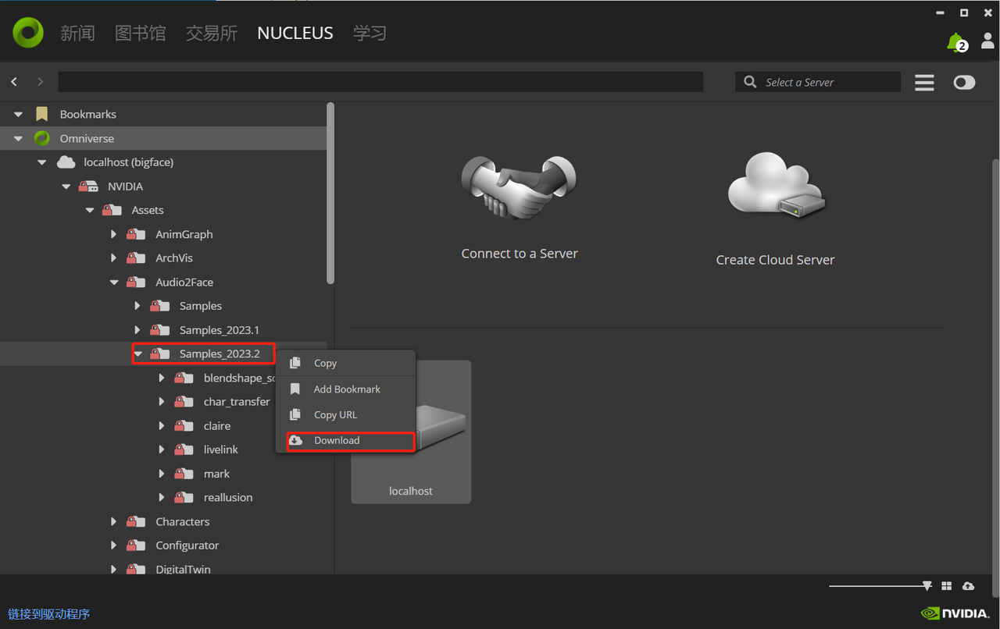

# 一、安装环境

## 1.1 Docker Desktop

### 1.1.1 下载并安装 Docker Desktop for Windows

下载地址：https://www.docker.com/products/docker-desktop/

## 1.2 Ollama

### 1.2.1 下载并安装 Ollama for Windows 

下载地址：https://ollama.com/download

## 1.3 Conda

### 1.3.1 下载并安装 Anaconda

从地址https://www.anaconda.com/download/success下载windows版本并安装，使用默认目录安装，避免后续修改脚本麻烦。

### 1.3.2 设置并激活python虚拟环境

打开anaconda promot，定位到代码根目录，执行以下命令：

```cmd
conda create --name paddle_speech python=3.9
conda activate paddle_speech 
pip install -r requirements.txt
```

## 1.4 Pycharm

### 1.4.1 下载并激活pycharm 2024.1

https://www.jetbrains.com/pycharm/download/other.html

## 1.5 安装直播软件

这里以b站直播软件为例。

下载并安装直播姬：https://link.bilibili.com/p/eden/download?hotRank=0#/web

# 二、资源准备

## 2.1 大语言模型

在 chat_ollama管理界面中，下载模型： ollama3:8b、ollama3.1:8b、glm4:9b、nomic-embed-text。
前三个为大语言模型，看需求切换，nomic-embed-text 为支持知识库所必须的。

## 2.2 paddle speech缓存

// TODO，可以暂时不用管，因为paddle_speech在需要时会自动下载。

## 2.3 audio2face的资源文件

### 2.3.1 添加 Omniverse Nucleus 服务器

添加一个名为localhost 的本地 Nucleus 服务器，参考文档：https://docs.omniverse.nvidia.com/nucleus/latest/workstation/installation.html

### 2.3.2 下载资源

定位到local服务器目录：localhost/NVIDIA/Assets/Audio2Face/Samples_2023.2，将该目录全部下载到本地。



# 三、安装服务

## 3.1 弹幕服务

### 3.1.1 克隆仓库代码

仓库地址：https://github.com/OrdinaryRoad-Project/ordinaryroad-barrage-fly

### 3.1.2 使用 Docker Compose 部署弹幕服务 

部署文档参考：https://barragefly.ordinaryroad.tech/deploy/#_2-1-2-%E5%89%8D%E7%AB%AF-%E5%90%8E%E7%AB%AF-mysql

注意：
1. 请使用 前端+后端+MySQL 的部署方式
2. 将文件中的 $PWD/ 替换为 ./ 。
3. 必须设置 MYSQL_ROOT_PASSWORD。

## 3.2 Chat Ollama服务

### 3.2.1 克隆仓库代码

仓库地址：https://github.com/sugarforever/chat-ollama

### 3.2.2 使用 Dcoker Compose 部署

```cmd
docker compose up
```

## 3.3 安装audio2face

### 3.3.1 安装 Nvidia omniverse launcher

下载地址：https://www.nvidia.com/en-us/omniverse/download/

### 3.3.2 安装 Audio2face

1. 打开Nvidia omniverse launcher，需申请Nvidia账号。
2. 定位到“交易所”，搜索audio2face
3. 安装测试版本2023.2.0
4. 安装成功后，在“图书馆”可以看到已安装的应用中的Audio2face。
5. 找到 Audio2face 的安装目录，后续会用到。参考这里：https://forums.developer.nvidia.com/t/path-to-built-in-audio-tracks/253146

# 四、运行数字人服务

## 4.1 使用Pycharm打开数字人服务源码

## 4.2 设置虚拟环境

设置pycharm当前项目的解释器为 conda 的 paddle_speech，也即上文设置的虚拟环境。

## 4.3 启动基础服务

### 4.3.1 设置弹幕服务
打开 Barrage Fly 服务主页，创建一个弹幕任务，启动后负复制任务id，后续会用到。

### 4.3.2 修改配置

打开config.py文件，修改相应的配置。

1. 修改 barrage_task_ids 为3.4.3.1复制的任务id，注意这里是一个字符串列表。
2. 修改 live_script_file_path ，该文件在当前项目 live/book 目录下，修改为实际的地址即可。
3. 修改 live_background_music_map ，这个参数是为了方便直播计划设置背景音乐，按照实际需求设置即可。
4. 修改 chat_ollama_system_prompt，系统提示词为自己需要的提示词，这个设置也即角色定制。
5. 修改 audio2face_usd_file_name，请参考2.3下载的 audio2face 的资源文件的存放目录。
6. 修改 speech_wav_save_path，即音频文件的缓存地址。
7. 修改测试用的直播计划脚本，在 /live/book 目录下，依据需求需改相应的配置，关于直播脚本计划的编写文档，后续会给出。

## 4.4 启动直播驱动程序

### 4.4.1 启动audio2face、语音合成服务和通讯服务

运行根目录下的 start.bat，会启动三个服务，分别是audio2face、语音合成服务和通讯服务。

### 4.4.2 启动数字人

数字人是由直播计划脚本所驱动的，由于代码并未完全完善，所以目前只能通过运行测试来启动直播计划。

1. 打开UE5的数字人项目或打开编译好的数字人UE程序。
2. 定位到源码文件 /tests/test_live_script.py。
3. 运行测试：test_executor，将会默认执行直播计划脚本 /live/book/live-script-book.yaml，也即 config.py 中配置的 live_script_file_path。